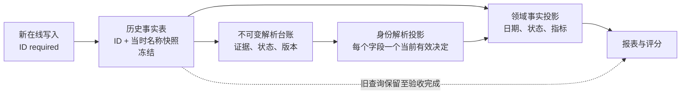

# 主数据身份治理实施方案

## 1. 方案结论

本次治理采用“历史事实冻结 + 不可变解析台账 + 可重建身份投影 + 按领域统计投影 + 逐消费者影子切换”。

这不是把历史数据搬到新表，也不是用新 ID 覆盖旧名称。历史业务表继续保存已经发生的业务事实和名称快照；新增的旁路只保存“这条历史记录当前应归属于哪个主数据 ID、依据是什么、决定经过了哪些版本”。统计结果从旁路投影产生，出现问题时可以切回旧查询或重建投影，不需要回滚、修改历史事实。

必须同时遵守以下红线：

1. 治理脚本不得再更新历史名称快照。
2. 无法唯一确认的记录保持未解析状态，不创建“历史遗留”兜底主数据。
3. 主数据改名不改变历史归属；软删除主数据仍可承载历史归属。
4. 新在线写入只接收稳定 ID，由服务端写入当时名称快照。
5. 每个统计消费者单独切换，禁止一次性替换全部报表。
6. 本次数据库备份只能证明当前基线，不能证明二月份以来所有名称从未被覆盖。

## 2. 当前生产基线

基线来源为 2026-08-01 提供的数据库备份。原始文件保持不变，本方案不依赖连接生产数据库。

| 事实表 | 活跃记录数 | 已知身份问题 |
| --- | --: | --- |
| `inspections` | 9,554 | 3 条有物料名但缺 `partId`；项目名称差异属于快照差异，不能直接判错 |
| `qms_inspection_requests` | 3,251 | 4 条缺 `partId`；1,226 条工序名称已有被回填改写的直接证据 |
| `quality_records` | 218 | 1 条供应商 name-only；9 条缺 `projectId`；117 条部门 ID 指向已退役部门 |
| `after_sales` | 54 | 4 条缺 `projectId`；1 条责任部门候选重名；24 条部门 ID 指向已退役部门 |
| `vehicle_commissioning_issues` | 53 | 纳入后续领域治理 |
| `work_orders` | 270 | 纳入后续领域治理 |
| `work_order_requirements` | 95 | 纳入后续领域治理 |

`unresolved_master_data_refs` 当前有 9,972 条活跃记录，其中 5,561 条为 `OPEN`。仅 `inspections.partId` 就有 4,815 条 `OPEN`，而事实表现存缺 ID 记录只有 3 条。这说明它适合作为可更新的治理工作清单，不适合作为统计真相或不可变证据台账。

当前四个核心域的身份投影上限约 32,457 行；完整领域事实投影初始约 13,077 行。对当前 2C/4G 环境，该规模适合使用数据库分批重建和增量更新，不需要引入新的外部数据平台。

### 历史承诺边界

正式验收口径为：

> 从新基线生效日起，治理流程不再改写事实表名称；基线以前已被改写且没有早期备份或 binlog 证据的字段，保留当前值并标记为来源不可完全追溯。

如果以后取得早期备份或 RDS binlog，只把恢复出的原始值追加为旁路证据，不反写事实表。

## 3. “旁路”具体指什么



- 历史事实表：保存业务发生时的数据，不由治理任务改写。
- 不可变解析台账：追加每一次解析决定和证据；旧决定只能被新版本替代，不能删除或覆盖。
- 身份解析投影：从台账计算出的当前有效归属，可整表删除并重建。
- 领域事实投影：把统计所需指标与有效 ID 物化到同一行，高频报表不必在查询时重复拼接身份逻辑。
- 旧查询：在影子阶段继续对用户提供结果，直到新旧差异通过验收。

因此，“旁路”不改变原数据；它把不确定性和修订历史放在原表之外。

## 4. 目标数据模型

最终字段名在 migration 设计评审时确认，下列为必须表达的语义。

### 4.1 不可变解析台账

新增 `historical_identity_resolutions`，由新的 `master-data-identity` 模块拥有：

```prisma
model historical_identity_resolutions {
  id                  String
  entityType          String
  entityId            String
  fieldName           String
  resolutionVersion   Int
  rawId               String?
  rawNameSnapshot     String?
  sourceFingerprint   String
  canonicalId         String?
  state               identity_resolution_state
  decisionSource      identity_decision_source
  evidence            Json?
  supersedesId        String?
  decidedBy           String?
  decidedAt           DateTime
  createdAt           DateTime
}
```

约束和索引：

- 唯一键：`(entityType, entityId, fieldName, resolutionVersion)`。
- 索引：`(entityType, entityId, fieldName, decidedAt)`、`(canonicalId, state)`、`(state, decidedAt)`。
- Service 只提供 append 和 supersede，不提供 update/delete。
- `sourceFingerprint` 由原始 ID、原始名称快照及相关证据生成，防止事实来源变化后沿用旧决定。
- 不对多种主数据表建立伪外键；由注册表验证 `canonicalId` 所属表和生命周期。

### 4.2 当前身份解析投影

新增 `identity_resolution_projection`：

```prisma
model identity_resolution_projection {
  entityType          String
  entityId            String
  fieldName           String
  sourceFingerprint   String
  effectiveCanonicalId String?
  state               identity_resolution_state
  resolutionId        String?
  projectionVersion   Int
  rebuiltAt           DateTime
}
```

唯一键为 `(entityType, entityId, fieldName)`。投影只保存当前结果，允许幂等 upsert、按域增量刷新和整表重建。报表不得自行实现 `fact.id ?? resolution.id`。

### 4.3 解析状态

| 状态 | 含义 | 是否进入已命名统计桶 |
| --- | --- | --- |
| `RESOLVED` | 有唯一、有效的 canonical ID | 是 |
| `RETIRED` | ID 指向已停用或软删除主数据，但历史归属有效 | 是，显示退役标识 |
| `UNRESOLVED` | 证据不足，尚不能确认 | 否，进入未解析桶 |
| `AMBIGUOUS` | 同一证据命中多个候选 | 否 |
| `CONFLICT` | 有效 ID、名称、关联记录等证据互相冲突 | 否 |
| `INVALID_ID` | 非空 ID 不存在或类型错误 | 否 |
| `NOT_APPLICABLE` | 该事实按业务类型不需要此身份字段 | 不参与该维度 |
| `UNKNOWN_PROVENANCE` | 当前值存在，但基线前来源无法证明 | 只在已有有效 ID 时按该 ID 统计并保留风险标识 |

禁止用兜底主数据 ID 表示任何待治理状态。

### 4.4 领域事实投影

身份投影仍需与事实表关联才能取得日期、状态和金额。高频统计按领域建立窄表，例如：

- `inspection_reporting_facts`
- `inspection_request_reporting_facts`
- `quality_issue_reporting_facts`
- `after_sales_reporting_facts`

每张表以源事实 ID 唯一，保存该领域需要的日期、状态、数值、有效身份 ID 和解析状态。现有 `quality_loss_index` 保留，并作为幂等重建实现样板。禁止创建一个包含所有业务指标的万能 EAV 投影。

### 4.5 消费者切换状态

复用 `system_settings` 保存受控消费者的模式，代码中维护允许的消费者注册表：

- `LEGACY`：用户读取旧结果。
- `SHADOW`：用户仍读取旧结果，后台生成并比较新结果。
- `PROJECTION`：用户读取投影结果，旧路径暂时保留以便回退。

设置键以消费者命名，例如 `identity.consumer.inspection_pass_rate.mode`。不得使用一个全局开关同时切换全部报表。

## 5. 模块职责

| 模块 | 职责 |
| --- | --- |
| `master-data-identity`（新增） | 解析台账、状态机、注册表、身份投影、基线指纹和重建服务 |
| `master-data-governance` | 治理清单与人工处理入口；调用身份模块公开接口，不拥有统计真相 |
| `supplier-identity` | 保留供应商与 TEAM 的显式映射；现有 unresolved 表仍是工作清单 |
| 各业务域模块 | 拥有自己的领域事实投影、统计查询和写入契约 |
| `metric-refresh` | 现阶段继续只承担既有指标任务；试点稳定后才增加独立 projection 类型和 worker |
| `utils` | 只保留基础设施；现有 canonical 业务逻辑分阶段迁移到模块公开 API |

各主数据表继续由原领域拥有。不得为了统一而把供应商、项目、物料、工序、部门合并成一张通用主数据表。

## 6. 实施工作包

每个工作包独立提交、独立验收。任何一包未过门禁，不进入下一包。

### WP0：止血与可信基线

实施内容：

1. 审核 `run-release-maintenance.sh` 及所有 backfill，移除会覆盖历史名称的自动 `--apply` 路径。
2. 将名称快照与当前主数据名不一致从阻断错误改成观察指标；继续校验 ID 存在性、类型和状态。
3. 修复 `resolveCanonicalIdsByNames`：规范化名称分组后只有唯一候选才能返回 ID；重名返回 ambiguity，不受数据库行顺序影响。
4. 修复 `persistUnresolvedCanonicalRefs`：重复扫描不得把 `RESOLVED` 人工裁决重置为 `OPEN`，也不得清空 `resolvedId`、操作人或裁决说明。
5. 删除已无调用方的 `MasterDataGovernanceKernel.rename` 死代码；管理接口继续明确返回“改名功能已下线”，不得保留可被重新接通的绕过路径。
6. 将历史引用软删除主数据解释为 `RETIRED`，而不是 `INVALID_ID`。
7. 建立只读、分页且确定性的身份基线命令；第一版输出每个受控字段的总量、软删除量、ID/名称覆盖、缺 ID 数和源指纹。日期/状态分布与金额合计在首批领域事实投影前由领域基线补齐。
8. 保存基线产物的校验和、生成版本和统计摘要，不保存生产密钥或连接串。

首批必须冻结审查的脚本包括质量记录供应商、检验供应商、报检供应商、售后供应商、检验问题责任、reporting identity 等回填脚本。历史名称写入必须删除；允许保留 dry-run、台账追加、ID 回填和投影重建。

验收门槛：

- 重名解析测试证明零静默归属。
- 重复扫描不改变已经完成的人工裁决，治理清单可以稳定收敛。
- rename kernel 及其调用能力从运行时代码删除，管理接口仍保持下线响应。
- 所有发布维护任务均不更新历史 name/snapshot 列。
- 同一备份连续生成两次基线，摘要和指纹完全一致。
- 现有数据库 migration 不回滚，事实表业务列零更新。

当前实现的基线入口为 `apps/backend/scripts/master-data-identity-baseline.ts`。它必须显式传入 `--output=<artifact-path>`，只执行分页 `SELECT` 并写出 JSON 产物；`contentChecksum` 排除生成时间，因此同一份静态备份重复生成时保持一致。该入口不在发布维护中自动运行，也不读取或保存连接串。

### WP1：旁路基础设施

实施内容：

1. 通过 additive Prisma migration 新增解析台账、身份投影、影子运行和差异明细表。
2. 建立受控字段注册表，明确实体表、ID 列、名称快照列、主数据类型和生命周期判断器。
3. 实现 append/supersede、状态转换、指纹校验、分批扫描、投影增量刷新和全量重建。
4. 第一版使用受控维护脚本分批重建，并由首批领域写入路径小范围幂等 upsert；试点稳定后再为 `metric_refresh_jobs` 增加独立 projection 类型与 worker，禁止混入 `SUPPLIER_SCORE` 任务。

实际实现：WP1 新增独立 `master-data-identity` 模块和四张旁路表；人工治理入口已从旧领域“改事实再结案”路径切换为队列 CAS、追加台账和投影更新。初始化脚本默认 dry-run，未加入 release maintenance。WP1 不创建 WP2 的领域事实投影，也不切换任何报表。5. 为消费者模式建立强类型注册表和管理员审计。

影子表至少记录运行 ID、消费者、基线版本、旧/新摘要、差异数、运行状态和样本差异。明细仅保留定位问题所需字段，避免长期复制全部报表结果。

验收门槛：

- 空台账投影、唯一 ID、重名、冲突、无效 ID、退役 ID 和来源变化均有测试。
- `decisionSource = MANUAL_DECISION` 时 `decidedBy` 必须非空；人工治理入口必须调用台账 append/supersede API，并有服务测试证明操作人和旧版本均被保留。
- 投影连续重建两次结果一致；中断后可从游标恢复。
- 删除投影后可仅依赖事实表和台账恢复。
- migration 只新增对象，不改变事实列定义和数据。

### WP2：首批试点——合格率、质量记录与报检任务

优先选择合格率及其质量记录、报检来源：`modules/report/pass-rate.ts` 仍存在按名称分桶，是当前统计串数的最高风险点；质量记录和报检任务数据量小，并且已经存在历史名称改写的直接证据，适合验证完整闭环。

实施内容：

1. 为 supplier、project、part、process、department 字段生成解析台账和身份投影。
2. 对有效现存 ID 直接形成 `RESOLVED/RETIRED` 决策；name-only 只允许唯一精确匹配，否则进入待治理状态。
3. 将过程/进货目标配置从名称键迁移为稳定 `processId` 或受控指标桶代码，并保留兼容读取直至切换完成。
4. 建立 `quality_issue_reporting_facts` 和 `inspection_request_reporting_facts`。
5. 先迁移合格率、供应商、责任部门、工序/物料统计消费者，不改变业务详情页历史名称展示。
6. 新旧统计按固定日期范围双跑并持久化差异。

每次影子运行先确定同一个事实集合 cutoff。新旧两侧都只能读取 `createdAt <= cutoff` 的事实；没有可靠 `createdAt` 的表使用可单调比较的主键边界或显式快照清单。业务日期窗口只在该事实集合内部筛选，避免补录到历史日期的数据在两次查询之间造成伪差异。

验收门槛：

- 总记录数、去重事实数、各状态数守恒。
- 新旧两侧使用相同事实 ID 集合和 cutoff，补录数据不得制造身份治理差异。
- 每条事实在每个适用维度恰好进入一个已解析桶或一个未解析桶。
- 总量、金额、状态和日期分布无丢失；差异均能定位到事实 ID 和解析决策。
- 改主数据当前名称后，历史归属和指标不变，只改变展示名。

### WP3：检验记录

实施内容：

1. 分批构建 9,554 条检验领域投影。
2. 迁移合格率、供应商来料、项目、工序、TEAM 和物料统计。
3. 按消费者依次执行 `LEGACY -> SHADOW -> PROJECTION`。
4. 对缺 ID 的 3 条物料记录和其他异常保留独立状态，不阻塞完整历史总量。

验收门槛：

- 合格/不合格数量、检验数量和分母定义逐消费者一致。
- 同名不同 ID 不合并，改名不拆分，退役身份不丢失。
- 投影查询计划命中索引；重建采用分页，不全量加载到内存。

### WP4：售后、供应商评分和跨域映射

实施内容：

1. 建立售后领域投影并迁移项目、供应商、部门统计。
2. 供应商评分只接受 canonical supplier ID；TEAM 通过 `supplier_identity_links` 显式映射。
3. 投影刷新与供应商评分分别使用独立任务类型，明确依赖顺序。
4. 对重名责任部门进入 `AMBIGUOUS`，由治理入口人工决策。

验收门槛：

- 评分输入集合、问题数、损失金额和最终评分逐供应商对账。
- 缺失 TEAM 映射不通过名称猜测，不误归属到同名供应商。
- 重新执行任务不重复计数，失败可重试。

### WP5：剩余领域

按“车辆调试问题 -> 工单与要求 -> 质量损失 -> 计量与监督检查”推进。每个领域重复以下固定流程：字段盘点、写入收口、旁路扫描、事实投影、影子对账、逐消费者切换、旧路径退出。

现有 `quality_loss_index` 不重建为新万能表，只补齐其身份来源、解析状态和可追溯版本。

### WP6：新数据强约束与旧路径退出

只有某一字段同时满足以下条件，才升级为 ID-required：

- 所有在线写入口只提交 ID。
- 服务端验证实体类型和可用状态，并生成名称快照。
- 新写入 `missing_id_count = 0`。
- 对应消费者全部进入 `PROJECTION` 且影子差异已关闭。
- 导入/backfill 入口已白名单化并写解析台账。

随后按字段分批增加数据库约束或外键。不得在历史缺口尚未分类前直接增加 `NOT NULL`，也不得立即删除名称列。旧查询、V1 接口和 feature flag 只有在无调用证据、回退窗口结束并通过全量门禁后才能删除。

## 7. 影子对账规则

影子运行不在每个用户请求中同步执行两套重查询。后台针对固定基线、事实集合 cutoff 和业务日期窗口运行，用户仍读取旧结果，从而避免 2C/4G 机器承受请求级双倍负载。cutoff 先固定可参与对账的事实集合，业务日期窗口再在集合内筛选；不能先后读取持续变化的事实表后直接比较。

每个消费者必须比较：

1. 事实记录总数和去重数。
2. 数量、金额、合格数、分母和状态分布。
3. 日期边界及时区。
4. 已解析、退役、未解析、歧义、冲突和无效 ID 数量。
5. 每个事实是否且仅是否进入一个合法桶。
6. 同名不同 ID 是否保持分离。
7. 主数据改名后归属与历史数值是否保持不变。

允许差异必须被登记为明确的口径修正，并有事实样本和审批记录；不得把“新结果看起来更合理”作为切换依据。

## 8. 发布与回滚

发布顺序固定为：

1. 备份与只读基线。
2. 部署 additive migration 和新模块，消费者仍为 `LEGACY`。
3. 构建旁路台账和投影，运行完整性校验。
4. 单个消费者切到 `SHADOW`，完成固定窗口对账。
5. 仅该消费者切到 `PROJECTION`。
6. 观察并继续离线对账；异常时立即将该消费者切回 `LEGACY`。

回滚不删除解析台账，也不反写事实表。应用回滚通过消费者模式完成；投影错误通过指定版本重建完成。Prisma migration 在生产只前进，因此首轮不得删除旧列、旧索引或旧查询依赖。

停止发布的条件包括：基线指标变化无法解释、投影出现重复/漏行、同一来源指纹得到非确定结果、影子差异不能定位、重建超出资源限制、任何治理任务试图更新历史名称。

首轮脚本处置清单：

| 脚本 | 处置 |
| --- | --- |
| `backfill-quality-record-supplier-identities.ts` | 保留自动 ID 回填与审计，禁止写 `supplierName` 快照 |
| `backfill-identity-relations.ts` | 保留缺 ID 的分批修复；已有快照不覆盖，未解析项不重开人工裁决 |
| `reporting-identity-backfill.ts` | 只写 canonical ID；禁止 `target.update` 改写项目/部门名称快照 |
| `backfill-inspection-*-identities.ts` | 只补 ID 与审计，禁止写供应商、TEAM、部门或事业部名称快照 |
| `backfill-after-sales-supplier-identities.ts` | 只补 ID 与审计，禁止写供应商名称快照 |
| `backfill-inspection-request-*-identities.ts` | 只补 ID 与审计，禁止写供应商或 TEAM 名称快照 |
| `backfill-quality-loss-index.ts` | 保留，其目标本身是可重建派生索引 |
| `reconcile-team-identities.ts` | 保留主数据和显式映射维护，禁止回写业务名称快照 |

## 9. 测试和发布门禁

每个工作包至少覆盖：

- 单元测试：状态机、唯一匹配、重名、冲突、退役、指纹和幂等。
- 数据库集成测试：append-only、并发 supersede、唯一约束、分页重建和任务恢复。
- 报表契约测试：ID 为 key，名称只作 label，未解析桶不被丢弃。
- 基线回归：使用脱敏固定数据集验证总量、金额、日期和状态守恒。
- 性能验证：数据库分页、批量写入、索引命中和 4 GB 内存边界。
- 发布门禁：`pnpm lint && pnpm run check:type && pnpm run check:qms-arch`，目标测试与全量后端测试通过，`rtk git diff --check` 通过。

## 10. 提交拆分

建议按以下边界独立提交，禁止把 schema、所有领域切换和旧代码删除混为一个提交：

1. `fix(identity): freeze historical name snapshots`
2. `fix(identity): reject ambiguous canonical name matches`
3. `feat(identity): add immutable resolution ledger`
4. `feat(identity): add rebuildable identity projection`
5. `feat(identity): add shadow comparison framework`
6. `feat(reporting): migrate quality issue identity facts`
7. `feat(reporting): migrate inspection request identity facts`
8. 后续每个领域和消费者各自提交。

每个提交必须包含对应测试、架构文档和 `CHANGELOG.md` 记录。

## 11. 完成标准

整个治理只有同时满足下列条件才算完成：

- 历史事实名称零治理改写。
- 所有受控在线新写入使用 ID-required 契约。
- 每个历史引用都有明确解析状态，不存在兜底 ID。
- 所有生产统计以 canonical ID 或领域事实投影聚合，不按名称归并。
- 所有消费者完成影子对账并可独立回退。
- 退役主数据继续保留历史统计，同名主数据不被合并。
- 不可变解析台账能够解释每个有效投影结果。
- 投影可以从事实表和解析台账完整重建。
- 旧名称解析路径、V1 写入口和临时 feature flag 已在调用归零后删除。

## 12. Agent 执行轮次估算

轮次表示一次“检查/修改/验证并根据结果继续”的工具调用循环，不是人工工期。

| 工作包 | 基础轮次 | 风险系数 | 风险调整后轮次 | 主要风险 |
| --- | --: | --: | --: | --- |
| WP0 止血与基线 | 5 | 1.3 | 7 | 多个历史脚本写入语义不同 |
| WP1 旁路基础设施 | 8 | 1.5 | 12 | append-only、并发与重建正确性 |
| WP2 首批试点 | 16 | 1.5 | 24 | 合格率名称分桶、历史名称改写和多状态口径 |
| WP3 检验记录 | 7 | 1.5 | 11 | 消费者多、统计分母不同 |
| WP4 售后与供应商评分 | 6 | 1.3 | 8 | 跨域 TEAM 映射和任务依赖 |
| WP5 剩余领域 | 6 | 1.5 | 9 | 字段语义和历史缺口分散 |
| WP6 强约束与退出 | 3 | 1.5 | 5 | 旧调用证据、约束发布与清理 |

- 基础实现合计：51 轮。
- 风险调整后：约 76 轮。
- 跨工作包集成、全量门禁和发布复核：约 8 轮。
- 总体执行预算：约 84 轮。

项目规则禁止给出按天或按周的工期估算，因此本方案只使用可观测的 Agent 执行轮次。每个工作包完成后用实际轮次校准后续预算。

## 13. 首个实施入口

实施从 WP0 开始，首个可发布结果必须同时包含：发布维护冻结、重名解析修复、快照审计语义修正、退役身份分类、基线生成器及对应测试。只有该结果通过全量门禁并证明没有更新事实名称，才创建 WP1 的数据库 migration。
